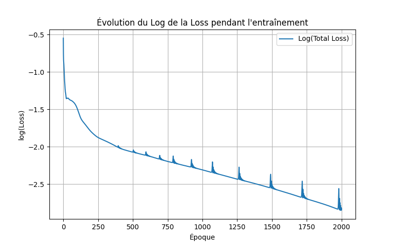
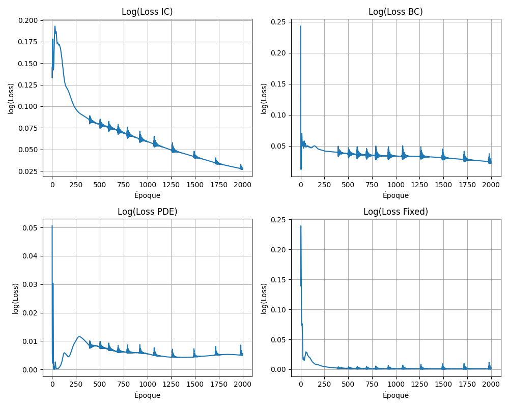
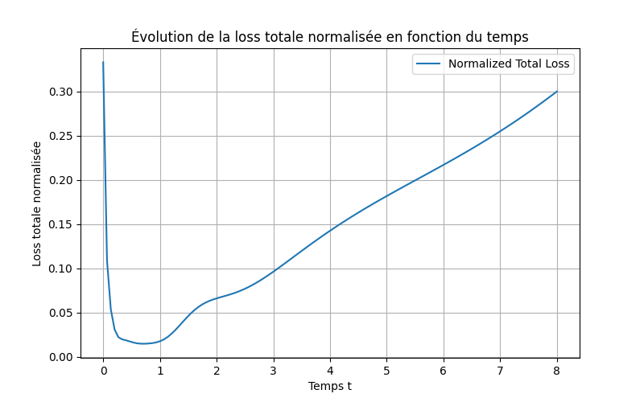

## Compte Rendu de la Simulation PINN pour l'Équation de la Chaleur

**Auteurs :** Hugo Miquel, Victor Guichard

### 1. Principe et Objectifs

L’objectif de cette simulation est de résoudre numériquement l’équation de la chaleur  

$$u_t = k\,(u_{xx} + u_{yy})$$

sur le domaine $[0,1]^2 \times [0,1]$ à l’aide d’un PINN (Physics-Informed Neural Network).  
Les objectifs principaux sont :
- **Approximations de solutions PDE** : Utiliser un réseau de neurones pour approcher la solution $u(x,y,t)$.
- **Incorporation des contraintes physiques** : Imposer les conditions initiales, les conditions aux limites et une contrainte fixe sur un point (ici $(0,0,t)$).
- **Analyse de la convergence** : Suivre l’évolution de la fonction de perte (loss) pendant l’entraînement pour observer la convergence du modèle.

### 2. Description de l'Algorithme et des Choix Techniques

#### a. Génération des données d’entraînement
- **Points de collocation** : $N_f = 10\,000$ points aléatoires dans le domaine $(x, y, t)$ pour évaluer le résidu de la PDE.
- **Condition initiale** : $N_0 = 400$ points pour lesquels $u(x,y,0)$ est défini (ici $1$ pour $y \ge 0.8$ et $0$ sinon).
- **Conditions aux limites** : $N_b = 400$ points sur le contour du carré, avec $u = 0$.
- **Contrainte fixe** : $N_{fixed} = 100$ points pour lesquels la solution en $(0,0,t)$ est imposée à $0.5$.

#### b. Modèle PINN
- **Architecture du réseau** : Un modèle entièrement connecté (Dense) avec trois couches cachées de 50 neurones chacune et une fonction d’activation *tanh*.  
  La couche de sortie n’utilise pas d’activation afin de permettre au modèle de représenter une plage non bornée de valeurs.
  
#### c. Définition du résidu de la PDE
- Le résidu $f_{pred}$est défini comme :
  
  $$f_{pred} = u_t - k\,(u_{xx} + u_{yy})$$
  
  Ce résidu est calculé à l’aide de *tf.GradientTape* pour obtenir les dérivées nécessaires par rapport aux entrées.

#### d. Fonction de perte totale
La fonction de perte est la somme de quatre contributions :
- **Perte sur la condition initiale (IC)** : Erreur quadratique entre la prédiction $u_0$ et la valeur imposée.
- **Perte sur les conditions aux limites (BC)** : Erreur quadratique sur le contour.
- **Perte sur le résidu de la PDE** : Erreur quadratique du résidu calculé.
- **Perte sur la contrainte fixe** : Erreur quadratique entre la prédiction et la contrainte imposée sur le point fixe.

#### e. Entraînement et Suivi de la Convergence
- **Optimisation** : Utilisation de l’optimiseur Adam avec un taux d’apprentissage de 0.001.
- **Boucle d’entraînement** : Le modèle est entraîné sur 2000 époques.  
  À chaque époque, la fonction de perte totale est calculée et la liste `loss_history` stocke la valeur de la loss pour suivre la convergence.

### 3. Visualisations

#### a. Évolution de la Loss
Une courbe en échelle semilogarithmique présente l’évolution de la perte totale (loss) sur l’ensemble des époques.  
*Cette image permet de vérifier que le modèle converge bien et d’identifier d’éventuelles difficultés d’optimisation.*

#### Evolution de la loss totale :

#### Evolution des 4 loss individuels :

#### b. Prédictions à Différents Instants
Quatre images statiques montrent la solution approximée $u(x,y,t)$ pour des instants fixes : $t = 0.0, \, 0.33, \, 0.66, \, 1.0$.  
*Ces images illustrent comment la température évolue dans le domaine spatial pour différents instants et permettent de visualiser l’effet des conditions imposées (IC, BC et contrainte fixe).*

### c. Animation de l'Évolution Temporelle  

Une première animation (animation_t1.gif) illustre l'évolution de $u(x,y,t)$ sur une durée de 1 seconde, représentant le comportement du modèle à l'intérieur du domaine d'entraînement.  
*Celle-ci permet de visualiser comment le réseau apprend et restitue la dynamique imposée par l'équation de la chaleur dans la zone couverte par les données d'entraînement.*  

#### Animation sur 1s :  
  

En complément, une seconde animation (animation_t8.gif) montre une extrapolation temporelle jusqu'à $t = 8$.  
*Elle permet d'observer le comportement du modèle en dehors de son domaine d'entraînement et d'analyser sa capacité à généraliser sur des temps plus longs.*  

#### Animation jusqu'à $t = 8$ :  

Si l'on veut on peut ajouter a cela le calcule de la loss normaliser par le nombre de point de l'espace en fonction du temps pour se rendre compte de la precision du model.

**Analyse et Commentaires :**

- **Performance dans le domaine d'entraînement ($t \leq 1$) :**  
  La loss reste faible dans la plage de temps où le modèle a été entraîné. Cela indique que le réseau parvient à respecter les contraintes imposées (conditions initiales, aux limites, et résidu de la PDE) dans cette région.

- **Extrapolation pour $t > 1$ :**  
  Au-delà de $t = 1$, la loss explose, révélant que le modèle a des difficultés à généraliser sa solution lorsque l'on sort de l'intervalle de temps d'entraînement. Cela suggère une limitation dans la capacité du réseau à extrapoler de manière fiable.

- **Comportement pour $t$ proche de 0 :**  
  Une remarque intéressante concerne la zone proche de $t = 0$. On pourrait s'attendre à une loss particulièrement faible ici, étant donné que cette région est directement couverte par la condition initiale. Cependant, le graphique montre que la loss n'est pas minimale, ce qui pourrait indiquer un sous-entraînement pour $t$ très petit.  
  En effet, la loss associée aux conditions initiales n'avait pas encore complètement décroit lors des itérations effectuées. En augmentant le nombre d'epochs ou la ponderation du nombre de points pour les conditions initiales, on pourrait espérer réduire cette loss, améliorant ainsi la précision du modèle pour $t$ proche de 0.

### Conclusion

Le projet démontre l’utilisation des PINN pour la résolution d’une équation de la chaleur.  
Les choix effectués (nombre de points, architecture du réseau, définition de la loss, etc.) permettent d’atteindre une convergence satisfaisante du modèle, vérifiée par l’évolution décroissante de la loss.  
Les visualisations fournies donnent un aperçu clair de la distribution spatiale de la solution à différents instants, mettant en évidence l’efficacité de l’approche pour intégrer les contraintes physiques dans l’apprentissage.
